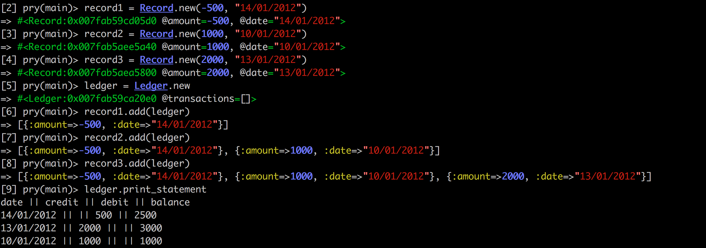

# Money tracker tech test

## User Stories

```
As a user.
So that I can monitor my cash flow.
I would like to be able to track the money I spend and earn.

As a user.
So that I can monitor the money I've spent.
I would like to be able to record the amount and the date I spent it on.

As a user.
So that I can monitor the money I've earned.
I would like to be able to record the amount and the date I earned it on.

As a user.
So that I can see all the records in one place.
I would like to be able to print an account statement that shows all the records (date, amount, balance).
```
## Tech Used
- Ruby, Rspec, SimpleCov (testing coverage), Rubocop (code quality).

## Approach
```
Initially, I started this project with 2 classes, a record and a ledger class. The record class
was quite minimal but was able to determine the structure of a record and add instances to the
ledger class. The ledger class had numerous responsibilities, including: formatting the records
and printing the records. As I moved through the project, it became apparent that I wasn't properly
encapsulating the responsibilities of the record class or the ledger class and required a ledger
method to grab appropriate records instead of allowing the records to have knowledge of the ledger.
This led to some restructuring of both classes and ultimately extracting the responsibilities of
formatting and printing the records from the ledger to a new statement class.
```

## Setup
Clone this repo using the command `git clone`
run `bundle` from the command line for gem dependencies
run `rspec` from the command line to see test coverage
run `rubocop` from the command line to see rubocop offenses
Use the pry implementation below to run the program

### Acceptance criteria

**Given** you record that you earned 1000 on 10-01-2012
**And** earned 2000 on 13-01-2012
**And** spent 500 on 14-01-2012
**When** you print your bank statement
**Then** you would see

```
date || credit || debit || balance
14/01/2012 || || 500.00 || 2500.00
13/01/2012 || 2000.00 || || 3000.00
10/01/2012 || 1000.00 || || 1000.00
```

### Implementation in pry



## Test Coverage

Coverage report generated for RSpec
62 / 63 LOC (98.41%) covered.
